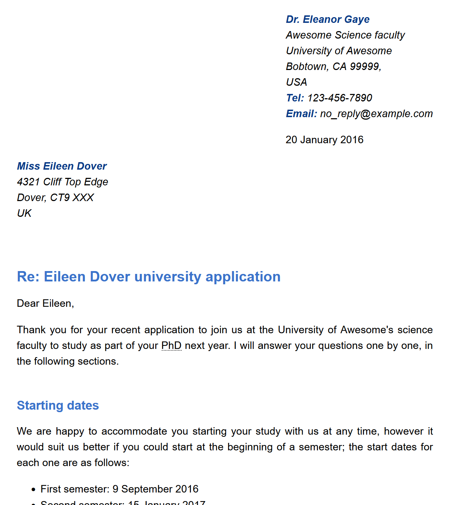
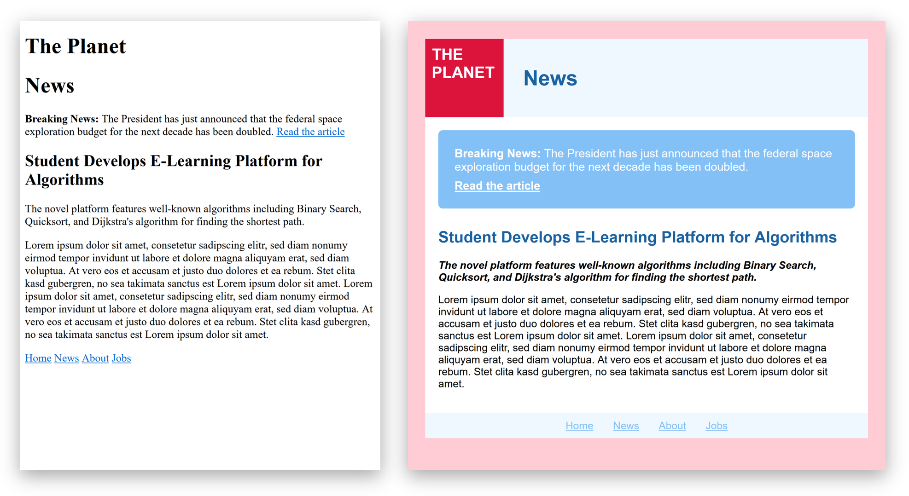

# Woche 2: CSS

## Rückblick HTML

* [Muster-Lösung zur Letter-Übung](../Woche%2001%20HTML/exercise-letter/letter-solution.html)
  * Vergleiche deine Lösung mit der Musterlösung, was sind die wichtigsten Unterschiede?
* [Statistik zu den am häufigsten verwendeten HTML Elemente](https://www.advancedwebranking.com/seo/html-study)
  * Deckt sich stark mit der Zusammenfassung der wichtigsten HTML-Elemente in den Slides


## Vorlesungsfolien

[CSS](02%20CSS.pdf)


## Übungen

### 1. Etwas CSS für den Letter (Vorlesung)

Das Dokument [letter.html](letter-styling/letter.html) enthält bereits CSS, direkt in einem `<style>`-Element. 
Verschiebe diese CSS-Regeln in eine separate Datei `letter.css` und verlinke diese im HTML.

Erweitere das Stylesheet um einige Regeln:

* Der ganze Brief soll in einer serifenlosen Schriftart (`sans-serif`) dargestellt werden.
* Die Überschriften im Brief sollen einen dezenten, nicht allzu gesättigten Blauton haben.
* Die Links sollen einen hellen, gesättigten Blauton haben.
* Begriffe, die definiert werden, sollen fett und kursiv sein.
* Alles, was fett ist, soll dunkelblau sein (ausser Überschriften).


### 2. Priorität & Spezifität (Vorlesung)

Welche Textfarbe haben die fünf Abschnitte in folgendem HTML-Dokument?

```html
<!DOCTYPE html>
<head>
    <title>Example</title>
    <style>
        p    { color: red;   }
        #foo { color: green; }
        .foo { color: blue;  }
    </style>
</head>
<p>One</p>
<p class="foo">Two</p>
<p id="foo" class="foo">Three</p>
<p style="color: purple;">Four</p>
<p class="foo" style="color: purple;">Five</p>
```

### 3. Letter fertig stylen (Vorlesung)

Erweitere das Stylesheet für den Letter erneut, sodass folgende Darstellung erreicht wird. Für den ersten Punkt musst du auch das HTML etwas anpassen.

* Adressat links-bündig, aber eingerückt
* Mehr Abstand zwischen Abschnitten (oberhalb von Überschriften)
* Platz für Unterschrift
* Blocksatz




### 4. News-Page layouten

Das Dokument [news.html](news/news.html) enthält eine einfache News-Seite. Erstelle ein Stylesheet `news.css`, um die Seite zu gestalten (ohne das HTML innerhalb von `<body>...</body>` zu verändern).

Ohne CSS sieht die Seite so aus wie links, mit könnte sie ungefähr so aussehen wie rechts:




### 5. CSS-Quiz

Zum Abschluss kannst du Dein Wissen in einem Quiz testen: https://www.w3schools.com/css/css_quiz.asp

Ein paar der Fragen beziehen sich auf spezifische Attribute, die du vielleicht noch nicht kennst, aber die meisten solltest du beantworten können.


### 6. CSS Zen Garden

Falls du noch mehr CSS-Übung möchtest, kannst du versuchen, das HTML-Dokument von [CSS Zen Garden](http://www.csszengarden.com/) zu stylen. Du findest es in der Datei «csszengarden.html».

Als Inspiration kannst du dir die [Design-Galerie](https://csszengarden.com/pages/alldesigns/) anschauen. Alle verwenden das gleiche HTML, aber sehen völlig unterschiedlich aus.
