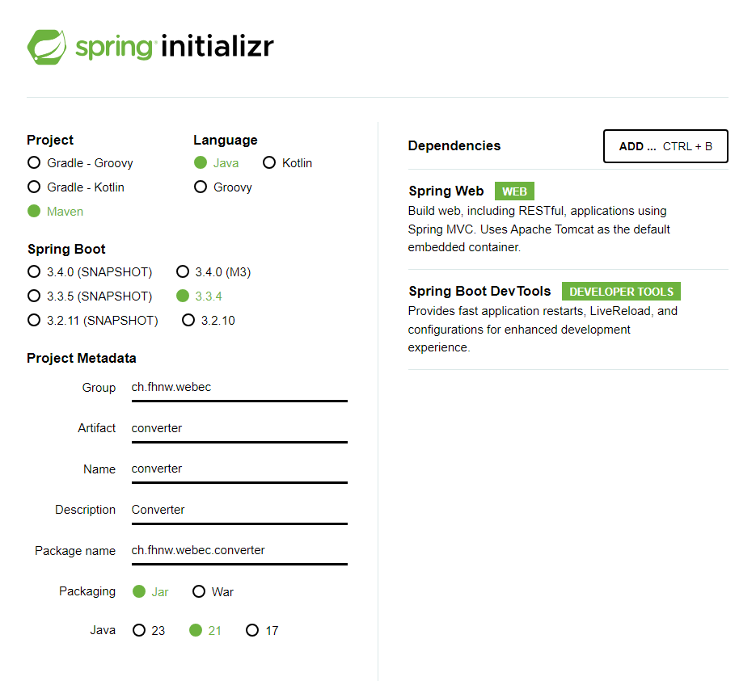
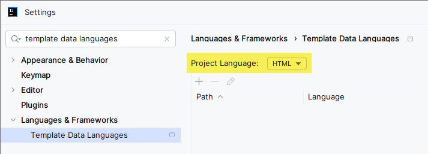
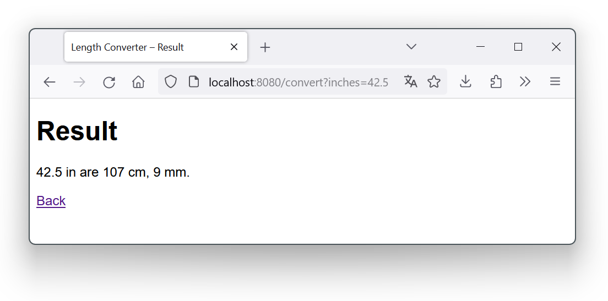

# Woche 3: MVC mit Spring Boot

## Vorlesungsfolien

[MVC mit Spring Boot](03%20MVC%20mit%20Spring%20Boot.pdf)


## Übungen

### 1. Einfacher Web-Server mit Java (Vorlesung)

Öffne ein Terminal und wechsle in den Ordner der CSS-Übung von letzter Woche.

Führe den Befehl `jwebserver` aus, um einen Web-Server zu starten, der den Inhalt des aktuellen Ordners über HTTP zur Verfügung stellt.

Öffne im Browser die URL http://localhost:8000 und dann die HTML Datei. Schau dir die HTTP Header der Requests in den Dev Tools an.


### 2. Entwicklungsumgebung vorbereiten (Vorlesung)

Installiere die IntelliJ-Entwicklungsumgebung. Empfohlen ist die Ultimate-Edition, welche Studierende gratis beziehen können: www.jetbrains.com/de-de/community/education/.

Stelle unter File → Project Structure sicher, dass JDK 21 installiert und ausgewählt ist.

Installiere zudem das Pebble-Plugin in IntelliJ, das es einfacher macht, Views zu erstellen.


### 3. Hello, Spring! (Vorlesung)

Erstelle mit IntelliJ oder dem [Initializr](https://start.spring.io) eine frische Spring-Boot-Applikation. Fülle alle Werte genau so ab wie im Screenshot:



Füge folgende Dependency zur POM-Datei hinzu:

```xml
<dependency>
    <groupId>io.pebbletemplates</groupId>
    <artifactId>pebble-spring-boot-starter</artifactId>
    <version>3.2.2</version>
</dependency>
```

Vergesse nicht, nach dem Hinzufügen das Maven-Projekt in IntelliJ neu zu laden:


Füge eine statische `index.html` Seite hinzu, starte die _ConverterApplication_ und kontrolliere, dass die Seite unter http://localhost:8080 erreichbar ist.


### 4. Der erste Controller (Vorlesung)

Füge folgende Klasse zum Projekt hinzu und ergänze die nötigen Imports:

```java
@Controller
public class TimeController {

    @GetMapping("time")
    public ResponseEntity<String> time() {
        var time = LocalTime.now();
        return ResponseEntity.ok()
                .contentType(MediaType.TEXT_HTML)
                .body("""
                        <!DOCTYPE html>
                        <title>Time</title>
                        <h1>Current Time</h1>
                        <p>
                            The current time is: %s
                        </p>
                        """.formatted(time));
    }
}
```

Rufe http://localhost:8080/time auf und lade ein paar Mal neu, um zu überprüfen, dass der dynamische Inhalt funktioniert.


### 5. MVC (Vorlesung)

1. Aktiviere HTML Syntax Highlighting in Pebble Templates:

    


2. Erstelle die Datei `time-view.peb` im Ordner `templates` mit folgendem Inhalt:

    ```html
    <!DOCTYPE html>
    <title>Time</title>
    <h1>Current Time with Pebble</h1>
    <p>
        {{ time }}
    </p>
    ```

    `{{ time }}` ist ein Platzhalter in der View, welcher durch den entsprechenden Wert aus dem Model ersetzt wird.


3. Ändere den Controller so ab:

    ```java
    @Controller
    public class TimeController {
    
        @GetMapping("time")
        public String time(Model model) {
            var time = LocalTime.now();
            model.addAttribute("time", time);
            return "time-view";
        }
    }
    ```

    Beim Aufruf von http://localhost:8080/time sollte wieder der gleiche dynamische Inhalt wie zuvor erscheinen, jetzt aber durch eine komplette MVC-Struktur erzeugt.

### 6. Length Converter (Vorlesung)

Implementiere einen neuen Controller, der eine Längenangabe von Inches in Zentimeter und Millimeter umwandelt.

Um Parameter an einen Controller zu übergeben, braucht es ein HTML-Formular:

```html
<form method="get" action="convert">
    <p>
        <input type="text" name="inches">
    </p>
    <p>
        <input type="submit" value="Convert">
    </p>
</form>
```

Das `"convert"` entspricht der Ziel-URL, welche der Browser beim Abschicken des Formulars aufruft. Das `"inches"` entspricht dem Parameternamen.

Nehme im Controller den Parameter entgegen, indem du einen normalen Methoden-Parameter mit dem gleichen Namen `inches` hinzufügst:

```java
@Controller
public class ConvertController {

   @GetMapping("convert")
   public String convert(double inches, Model model) {
      ...
   }
}
```

Führe die Umwandlung im Controller durch und erweitere Model & View, um das Resultat anzuzeigen:




### 7. Length Converter erweitern

Erweitere den Length Converter so, dass er auch ein _Feet_-Feld entgegennimmt und dieses zusammen mit den Inches in Zentimeter und Millimeter umrechnet.

Style diese kleine Web-App mit etwas CSS, das Sie in einer separaten Datei ablegen und im `<head>`-Bereich der beiden Seiten einbinden.


### 8. Unit Test

Implementiere für den Length Converter einen Unit Test.


### 9. Currency Converter (optional)

Implementiere einen weiteren Controller, der einen Betrag in einer Währung in eine andere umrechnet. Du kannst fixe Umrechnungskurse verwenden.