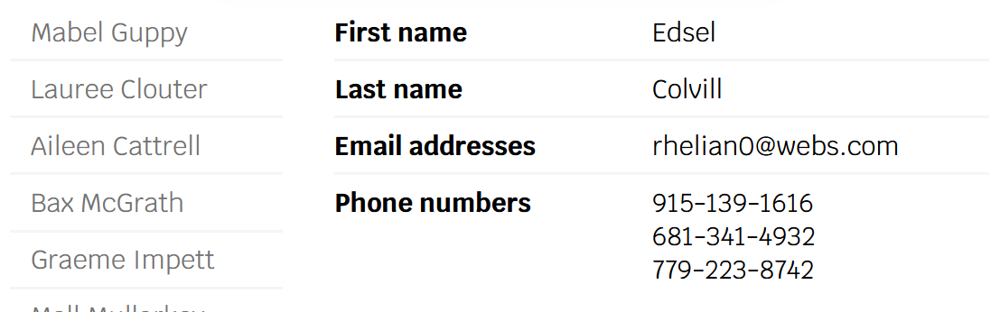
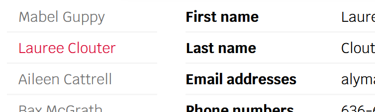
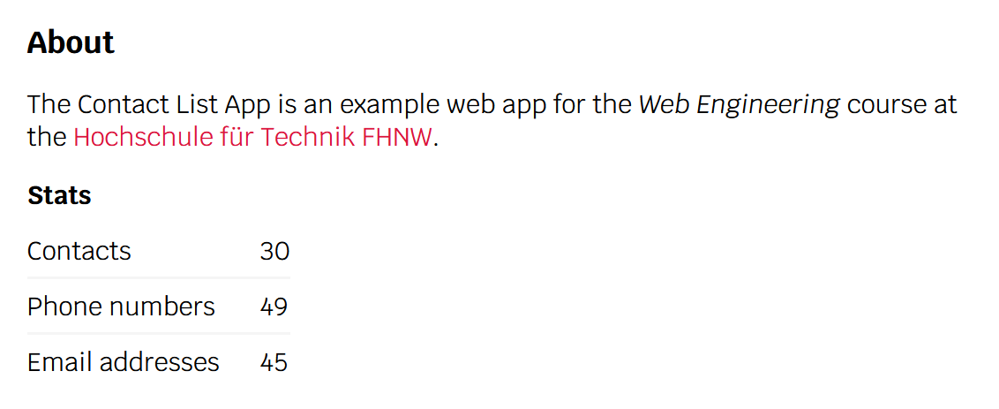
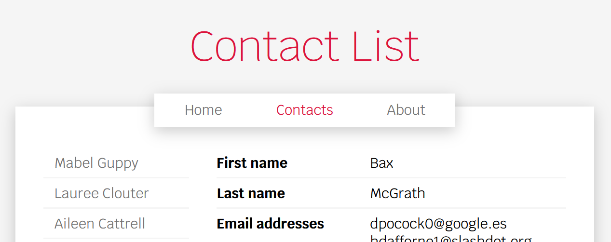

# Woche 4: HTML-Templates

## Vorlesungsfolien

[Templates](04%20Templates.pdf)

## Übungen

In den nächsten drei Wochen wirst du laufend die gleiche Web-App erweitern. Die Lösung dieser Woche entspricht also der Vorlage für nächste Woche und die Lösung für nächste Woche der Vorlage für Woche 6.

Pebble Dokumentation: https://pebbletemplates.io

### 1. Schleifen in Templates (Vorlesung)

Mache dich mit dem Code in «contactlist-pebble» vertraut. Beachte insbesondere den vorhandenen Controller und das dazugehörige Template. Kompiliere und starte die App und prüfe, dass sie unter http://localhost:8080/contacts erreichbar ist (unter [/](http://localhost:8080/) gibt es vorerst einen Fehler).

Erweitere das Contacts-Template so, dass die Liste von Kontakten angezeigt wird. Dafür brauchst du `` und das `contactList`-Attribut aus dem Model. Jeder der Einträge soll ein Link sein, der auf `/contacts/{id}` verweist, wobei `{id}` die ID des entsprechenden Kontakts ist. Für diese URLs gibt es bereits ein Mapping im vorhandenen Controller, welches wieder dasselbe Template zurückgibt.

### 2. Verzweigungen in Templates (Vorlesung)

Erweitere das Template erneut, sodass rechts neben der Kontaktliste eine Tabelle mit den Details des ausgewählten Kontakts angezeigt wird (`contact`-Attribut aus dem Model).

Für fehlende Eigenschaften soll keine Zeile angezeigt werden. Falls kein Kontakt ausgewählt ist, soll eine Meldung zum Auswählen eines Kontakts eingeblendet werden. Verwende ``.

### 3. Code-Duplizierung reduzieren mit Macros

Das Darstellen der Tabelle braucht einiges an dupliziertem Code. Verbessere das, indem du in einer separaten Datei `macros/contacts.peb` zwei Macros definierst; eines für einfache Zeilen und eines für Zeilen mit Listen von Werten (Telefonnummern und E-Mail-Adressen).

### 4. Styling & aktiver Kontakt

Verbessere das Layout und Styling mittels CSS. Ändere das Template ausserdem so ab, dass der aktuell ausgewählte Kontakt in der Liste hervorgehoben wird. Definiere dazu eine CSS-Klasse `.active`, welche das Template nur zu dem Link des ausgewählten Kontakts hinzufügt:

### 5. Startseite & gemeinsames Layout

Füge ein neues Template `index.peb` hinzu, als Startseite der Applikation. Ein `index.peb`-Template wird ohne Controller auf den Pfad [/](http://localhost:8080/) abgebildet, aber du musst die App nach dem Erstellen neu starten.

Die beiden Seiten sollen dasselbe Grundlayout (Header, Main, Footer) erweitern (``). Extrahiere dazu das Skelett des Contacts-Templates in eine separate Datei `layout.peb`. Definiere zwei Blöcke (``) namens `title` und `main`, welche von `index.peb` und `contacts.peb` überschrieben werden.

### 6. About-Seite

Füge eine «About»-Seite zur Applikation hinzu, wobei das Template ebenfalls `layout.peb` erweitert. Die Seite soll eine kurze Beschreibung der Applikation, einen Link zur Website der Hochschule für Technik und eine Tabelle mit Statistiken enthalten.

Füge dazu einen neuen Controller und ein neues Template hinzu. Das Model für die Seite soll drei Attribute enthalten, welche in der Statistik-Tabelle angezeigt werden: Anzahl Kontakte, Anzahl Telefonnummern und Anzahl E-Mail-Adressen im Datensatz.

### 7. Navigation

Erweitere das Layout so, dass auf allen Seiten ein Navigations-Menu angezeigt wird. Das Menu soll drei Einträge enthalten, für die Startseite, die Contacts-Seite und die About-Seite. Die aktive Seite soll wieder hervorgehoben werden:

Du kannst das vordefinierte `request.servletPath`-Attribut verwenden, um den Pfad der aktuellen Seite zu erhalten.
