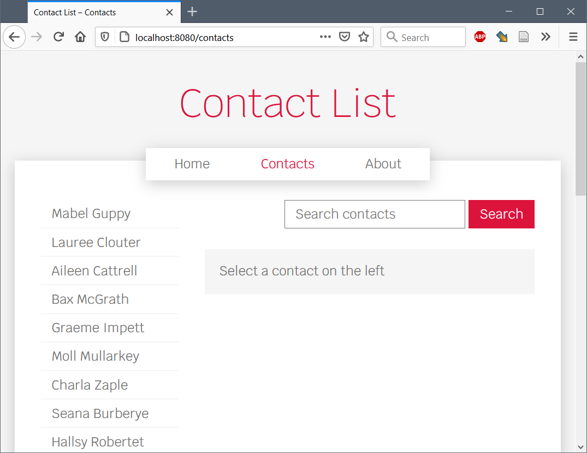
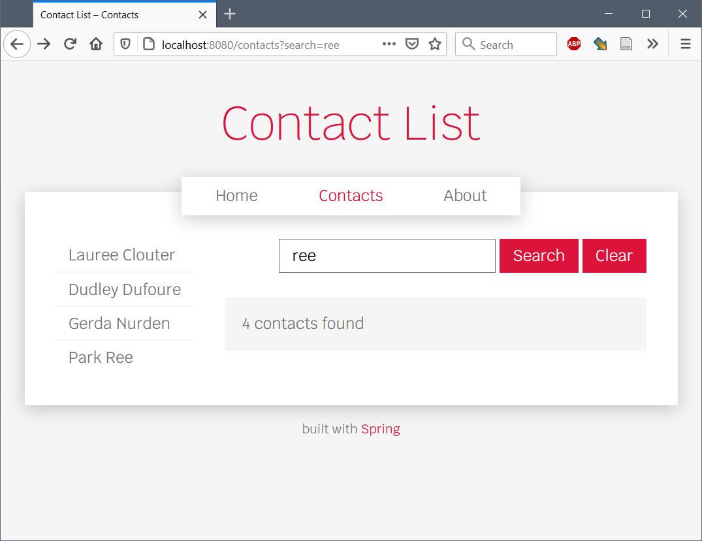
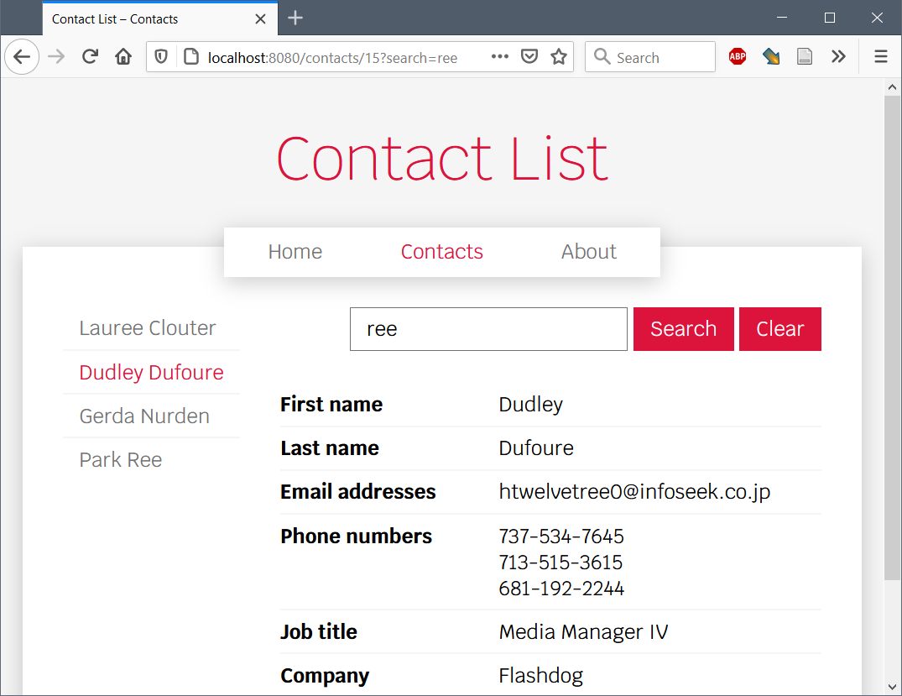

# Woche 5: E2E-Tests, Validierung mit Spring

## Vorlesungsfolien

[E2E-Tests](05%20E2E-Tests.pdf)


## Übungen zu E2E-Tests

Die Vorlage von dieser Woche, «contactlist-e2e» entspricht der Lösung von letzter Woche. Du kannst auch deine eigene Lösung für folgende Übungen weiter verwenden.


### 1. Einfacher E2E-Test (Vorlesung)

Erstelle einen einfachen E2E-Test, der testet, ob auf der Contacts-Seite alle 30 Kontakte-Links angezeigt werden. Weiter soll geprüft werden, dass durch das Klicken auf einen solchen Link die Details des entsprechenden Kontakts angezeigt werden.

Verwende dafür folgende Maven-Dependencies:

```
<dependency>
    <groupId>org.seleniumhq.selenium</groupId>
    <artifactId>selenium-java</artifactId>
    <version>4.25.0</version>
</dependency>
<dependency>
    <groupId>io.github.bonigarcia</groupId>
    <artifactId>webdrivermanager</artifactId>
    <version>5.9.2</version>
    <scope>test</scope>
</dependency>
```

### 2. `mvn verify` (Vorlesung)

Passe das Projekt so an, dass `mvn test` nur noch die Unit Tests ausführt. Mit `mvn verify` sollen auch die E2E tests ausgeführt werden.

Wichtig: Diesmal brauchen wir ein Maven Plugin, nicht eine Maven Dependency:

```
<plugin>
    <groupId>org.apache.maven.plugins</groupId>
    <artifactId>maven-failsafe-plugin</artifactId>
</plugin>
```

Damit ein Test nur in der `verify` Phase ausgeführt wird, muss er `IT` im Namen haben.

Achtung: Da wir den Maven Wrapper verwenden, heissen die Befehle leicht anders (z.B. `.\mvnw.cmd test` unter Windows).


### 3. Page-Object-Pattern (Vorlesung)

Erstelle eine Page-Object-Klasse für die Contacts-Seite, mit Attributen für die Kontakte-Links und die Kontakt-Details.

Refactore anschliessend den E2E-Test, sodass solche Page-Objects verwendet werden.


## Übung Suchfeld und Kontakte filtern

In den restlichen Übungen implementieren wir eine Suchfunktion für die Contacts-Seite. Das Suchfeld soll die Kontakte filtern, indem nur diejenigen Kontakte angezeigt werden, deren Details *irgendwo* den eingegebenen Suchbegriff enthalten. Das Suchfeld könnte ungefähr so aussehen:



Auf eine Suchanfrage antwortet der Server mit der bekannten Contacts-Seite, aber es werden nur die Kontakte angezeigt, deren Details den Suchbegriff enthalten:



Wenn man anschliessend auf einen solchen Kontakt klickt, soll die Suche «erhalten» bleiben, d. h. die Details des Kontakts werden angezeigt, aber die Kontakte-Liste wird weiterhin gefiltert:



Erst wenn man auf den «Clear»-Button klickt, wird die Suche zurückgesetzt und alle Kontakte werden wieder angezeigt.

In den folgenden Übungen implementieren wir diese Suchfunktionalität Schritt für Schritt.


### 4. `ContactService` erweitern

Erweiterne als Erstes die Klasse `ContactService` um eine Methode `searchContactList`, welche die Kontakte filtert und nur diejenigen zurückgibt, deren Details den Suchbegriff enthalten. Die Methode könnte ungefähr so aussehen:

```java
public List<ContactListEntry> searchContactList(String search) {
    // TODO
}
```

Füge in der Klasse `ContactServiceTest` Unit-Tests für die neue Methode hinzu.


### 5. Suchfeld und Kontakte filtern

Erweitere die Contacts-Seite um ein Suchfeld. Dafür braucht es ein kleines HTML-Formular (`<form>`), welches ähnlich funktioniert wie beim Length-Converter.

Bei der Eingabe von «ree» soll beispielsweise eine Get-Anfrage mit der URL `/contacts?search=ree` an den Server gesendet werden. Der vorhandene Controller soll den Suchparameter entgegennehmen und mittels der neuen Methode `searchContactList` die Kontakte filtern und ins Model einfügen. Der Teil vom Pebble-Template, welcher die Kontaktliste anzeigt, sollte weiterhin funktionieren.

Füge einen E2E-Test hinzu, welcher das Suchfeld und die Kontakte-Filterung testet. Mit einem `WebElement`-Objekt, das ein Eingabefeld repräsentiert, kann mittels `sendKeys("...")` ein Suchbegriff eingegeben werden. Anschliessend kann mit `click()` auf das `WebElement`-Objekt, welches den Such-Button repräsentiert, das Formular abgeschickt werden.


### 6. Persistente Suche

Ändere das Pebble-Template für die Kontaktliste so ab, dass die Links zu den Kontakten den Suchbegriff erneut als Parameter an den Server schicken, sodass die Suche erhalten bleibt. Das kann man mit folgendem Ansatz lösen: Erstmal greift man via `request`-Objekt auf die aktuellen Query-Parameter zu:

```html

```

Anschliessend prüft man beim Generieren der Kontakte-Links, ob momentan ein Suchbegriff aktiv ist, und fügt diesen gegebenenfalls wieder als Query-Parameter an die Links an, z. B. mit einem `if`-Block:

```html

    <a href="...?search={{ search }}">...</a>

    ...

```

Füge anschliessend einen «Clear»-Button hinzu, welcher die Suche beendet, indem er die Seite ohne Suchparameter neu lädt.

Teste die neue Funktionalität mit einem E2E-Test, insbesondere die Abfolge von «Search» und «Clear».


### 7. Validierung des Suchtexts

Füge eine Validierung für den Suchtext hinzu: Dieser soll aus mindestens 3 Zeichen bestehen. Die Validierung soll sowohl auf dem Server (mittels `@Validated` und `@Size`) als auch im Client (mittels `minlength`-Attribut bei `<input>`) gemacht werden.


### 8. Konfigurierbare Mindestlänge

Lagere die Mindestlänge des Suchtexts als eine Konfigurations-Option in die «application.properties»-Datei aus. Beachte, dass die Server-seitige Validierung jetzt «von Hand», d. h. ohne `@Size` gemacht werden muss. Überlege dir, wie du die konfigurierbare Mindestlänge auf dem Client erzwingen kannst.
