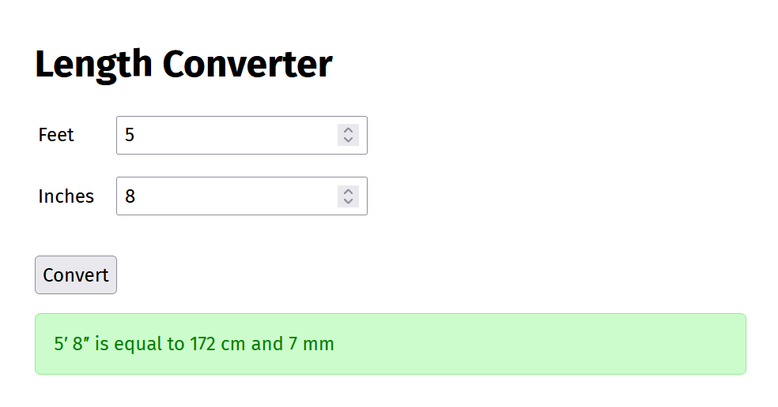
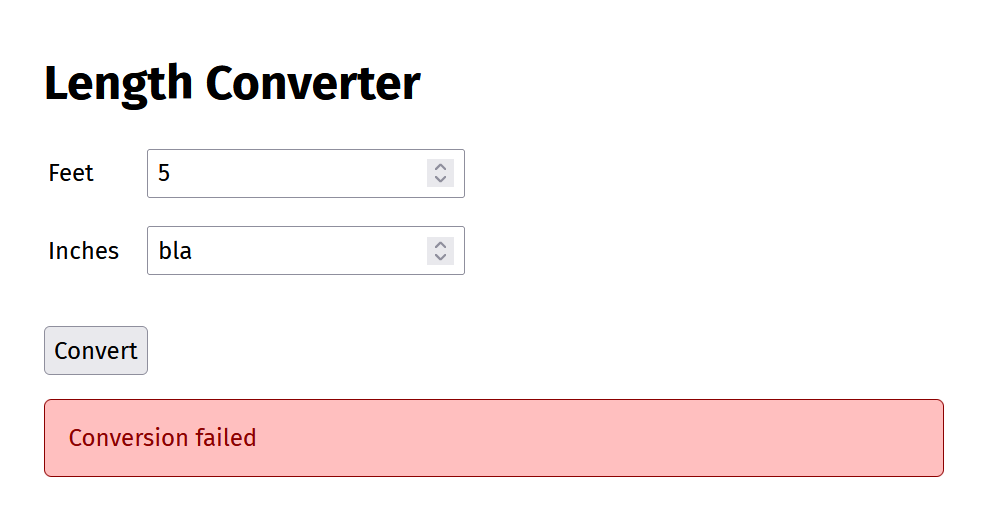

# Woche 11: JavaScript

## Vorlesungsfolien

[JavaScript.pdf](JavaScript.pdf)


## Übungen


### 1. Typkonvertierung in JavaScript (Vorlesung)

Gewisse Operatoren und Anweisungen wandeln Werte automatisch um. Verwende die JavaScript-Konsole im Browser, um zu bestimmen, welche Ausgabe folgende Codestücke erzeugen. Überlege dir jeweils vorher, was du erwartest.


```javascript
console.log(false + 5);
```

```javascript
console.log('1' == 1);
```

```javascript
console.log(4 + '2' - 2);
```

```javascript
if ('Hello, World!') {
    console.log('yes');
} else {
    console.log('no');
}
```


### 2. Anfragen an eine REST-API

Im Projekt «length-converter-rest» findest du eine REST-Version des Length Converters. Vervollständige die App so, dass die Konvertierung mittels JavaScript und REST-Anfragen passiert.

Erstellen dazu eine Datei 'script.js' im Ordner 'static' und ändere die 'index.html'-Datei so ab, dass dieses Script geladen wird.

Füge in diesem Script einen Event-Handler zum «Convert»-Button hinzu, welcher die Werte aus den Textfeldern ausliest und vorerst auf der Browser-Konsole ausgibt. Prüfe mit den Developer-Tools im Browser, dass das Script funktioniert.

Führe nun mittels Fetch API die Anfrage an die REST-Schnittstelle aus und gib das Resultat auf der Konsole aus.


### 3. Zugriff auf das DOM

Verbessern den Code so, dass die Antwort nicht mehr auf der Konsole erscheint, sondern schön formatiert ins Element `#result` geschrieben wird:



Falls die Konvertierung fehlschlägt, soll eine Fehlermeldung angezeigt werden:




### 4. Sofortige Umwandlung

Ändere das Programm zum Schluss so, dass die Konvertierung nicht auf Knopfdruck, sondern bei jeder Änderung der Textfelder durchgeführt wird. Den «Convert»-Button kannst du entfernen.