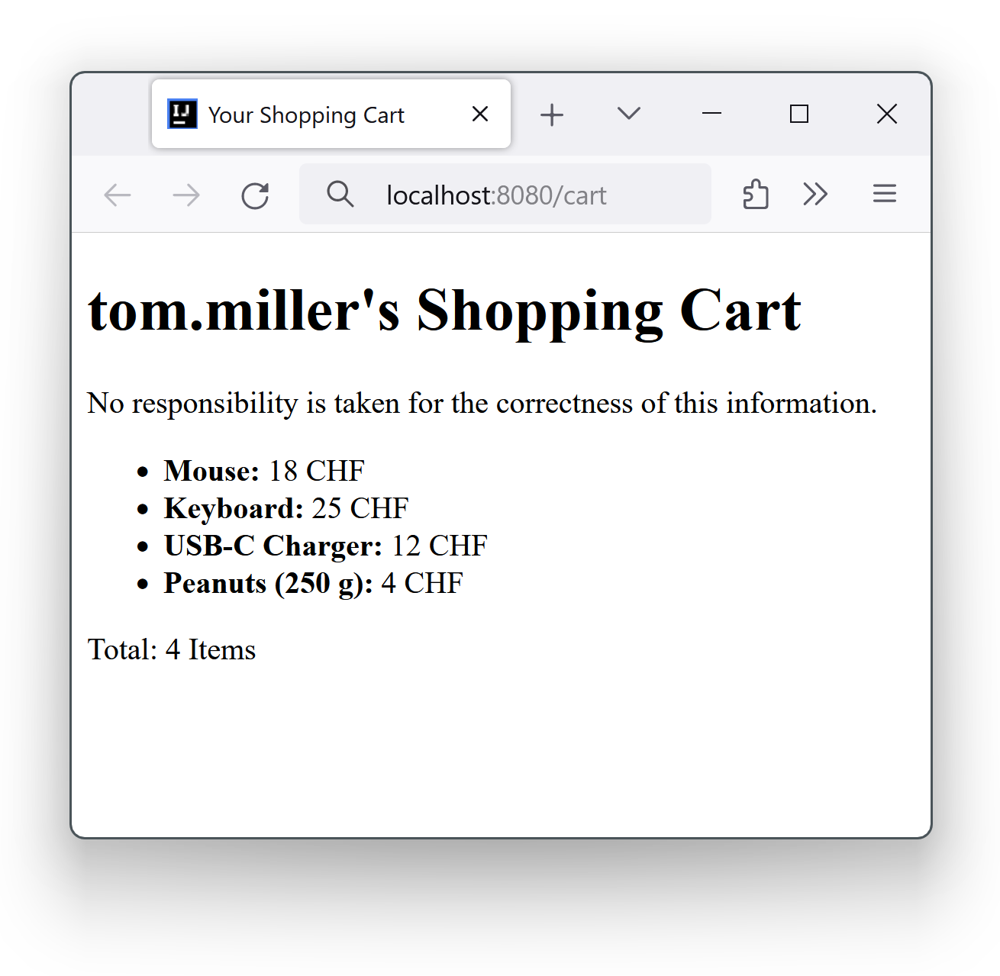
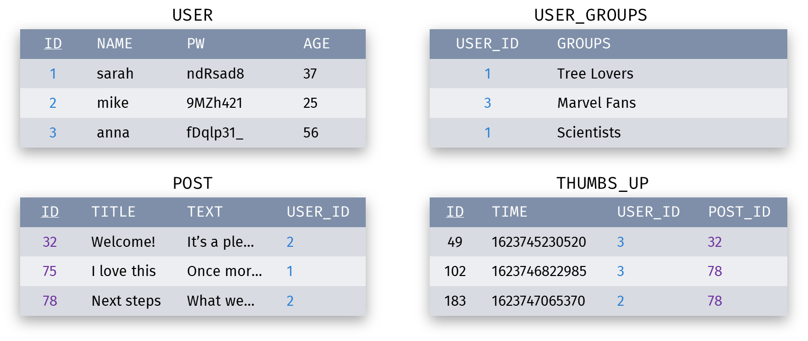

# Woche 15: Prüfungsvorbereitung


## Übungen

Es ist empfohlen, folgende Übungen unter Prüfungsbedingungen zu lösen, d. h. ohne IDE und nur mit einer Zusammenfassung von 2 A4-Seiten.

[→ Lösungen](loesungen.md)

### 1. Gültiges HTML

Geben Sie an, ob folgende HTML-Ausschnitte gültig sind (d. h. ob sie in einem gültigen HTML(-5)-Dokument _vorkommen_ könnten):

a)
```
<p>Hello, <em>World!</em></p>
```

b)
```
Hello<p>World!</p>Bye.
```

c)
```
Look at this: 
```

d)
```
<em>Hello, <strong>World!</em></strong>
```

e)
```
<p>Foo <em>Bar</em> <em font-size="24">Baz</em>
```

f)
```
<body>
  <p>Hello, World!<p>
  Bye.
</body>
```

g)
```
<html>
  <head>
    <title>Home</title>
  <h1>Home</h1>
</html>
```

### 2. CSS-Selektoren

Gegeben sei ein HTML-Dokument mit folgendem Body (die Zahlen in Klammern gehören nicht zum Dokument, sondern sind Markierungen für die Aufgabenstellung):

```html
<body> (1)
  <nav class="menu"> (2)
    <ul> (3)
      <li>Home</li> (4)
      <li>Shop</li> (5)
      <li> (6)
        About <em>me</em> (7)
      </li>
    </ul>
  </nav>
  <div> (8)
    <h1>Home</h1> (9)
    <p class="normal"> (10)
      Hi, <em>stranger</em> (11)
    </p>
    <div id="footer"> (12)
      Made by <em>Web Inc.</em> (13)
    </div>
  </div>
</body>
```

Geben Sie für die folgenden CSS-Selektoren an, welche der Elemente (1) bis (13) sie auswählen:

a) `.normal`

b) `div > em`

c) `div.footer em`

d) `nav ul, li em`

e) `ul :not(:first-child)`

f) `li + li`


### 3. CSS-Regeln

Gegeben sei ein HTML-Dokument mit folgendem Body:

```html
<body>
  <nav class="menu">
    <ul>
      <li>BLUE</li>
      <li>GRAY</li>
      <li>BLUE <em>GREEN</em></li>
    </ul>
  </nav>
  <div>
    <h1>ORANGE</h1>
    <p class="normal">
      ORANGE <em>GREEN</em>
    </p>
    <div id="footer">
      RED <em>PURPLE</em>
    </div>
  </div>
</body>
```

Schreiben Sie eine Reihe von CSS-Regeln, sodass die Schriftfarben im gerenderten Dokument dem Text entspricht. Also alle `BLUE`-Texte sollen blau sein, der `GRAY`-Text soll grau sein, usw.

Es gelten folgende Einschränkungen:

* Maximal 6 Regeln
* Keine Selektoren mit Komma

Sie können folgende Farbwerte verwenden: `blue`, `gray`, `green`, `orange`, `red`, `purple`.


### 4. Spring Controller

Gegeben sei folgendes HTML-Formular:

```html
<form method="get" action="/convert">
  <p>
    <label for="amount">Amount (USD)</label>
    <input type="number" id="amount" name="amount" required>
  </p>
  <p>
    <label for="currency">Target currency</label>
    <input type="text" id="currency" name="target-currency" required>
  </p>
  <p>
    <input type="submit" value="Convert">
  </p>
</form>
```

Zusätzlich sei ein Spring-Bean gegeben, welches folgendes Interface implementiert:

```java
public interface CurrencyConverter {
    double convert(double amountUsd, String targetCurrency);
}
```

Schreiben Sie eine Controller-Klasse, welche ein solches Formular entgegennimmt, die Umwandlung mit einem `CurrencyConverter` durchführt und eine Pebble-View mit Dateinamen «conversion-result.peb» rendert. Die View erwartet das Resultat in einem Model-Attribut namens «result».

Import-Anweisungen können Sie weglassen.


### 5. Pebble-Template

Gegeben sei folgender Spring-Controller:

```java
@Controller
public class ShopController {
    
    @GetMapping("/cart")
    public String displayCart(Model model) {
        String username = // ...
        List<Item> shoppingCart = // ...
        model.addAttribute("user", username);
        model.addAttribute("cart", shoppingCart);
        return "shopping-cart";
    }
    
    public static class Item {
        private String name;
        private int price;
        // Konstruktor, getName(), getPrice()
    }
}
```

Vervollständigen Sie folgendes Pebble-Template in der Datei «shopping-cart.peb», sodass das resultierende HTML valid ist und von einem üblichen Browser ungefähr so dargestellt wird wie im Bild unten (vorausgesetzt, entsprechende Items sind vorhanden):

```html
<!DOCTYPE html>
<html lang="en">
<head>
    <title>Your Shopping Cart</title>
</head>
<body>
    __________________________________________________
    __________________________________________________
    __________________________________________________
    __________________________________________________
    __________________________________________________
    __________________________________________________
    __________________________________________________
    __________________________________________________
    __________________________________________________
    __________________________________________________
</body>
</html>
```




### 6. JPA

Gegeben seien folgende Datenbanktabellen:



Schreiben Sie eine Reihe von Java-Klassen inklusive JPA-Annotationen, welche von JPA in ein passendes Schema umgewandelt werden. Die IDs sollen automatisch generiert werden. Getter, Setter und andere Methoden können Sie weglassen.


### 7. Spring Data

Gegeben seien die Entity-Klassen der letzten Aufgabe, inklusive folgenden Methoden/Konstruktoren:

Klasse `User`:

* `public User(String, String, int)`

* `public void setGroups(Set<String>)`


Klasse `Post`:

* `public Post(String, String, User)`

Schreiben Sie ein Codestück, welches die Tabellen `USER`, `USER_GROUPS` und `POST` so wie in der letzten Aufgabe dargestellt mit Daten füllt. Gehen Sie davon aus, dass zwei `JpaRepository`s namens `userRepo` und `postRepo` zur Verfügung stehen.


### 8. REST-APIs

Stellen Sie sich eine REST-API für eine Büchersammlung vor, basierend auf JSON. Bücher sind Ressourcen unter [/api/books/###](), wobei ### eine Server-generierte ID eines Buchs ist. Alle Bücher bestehen aus einem Titel, einem Autor, einem Jahr und einer Seitenzahl.

Ein Client dieser API erstellt ein neues Buch und löscht das Buch anschliessend wieder. Beide Operationen sind erfolgreich. Schreiben Sie zwei HTTP(1.1)-Anfragen und die entsprechenden zwei Antworten auf, welche dabei hin- und hergeschickt werden könnten.
